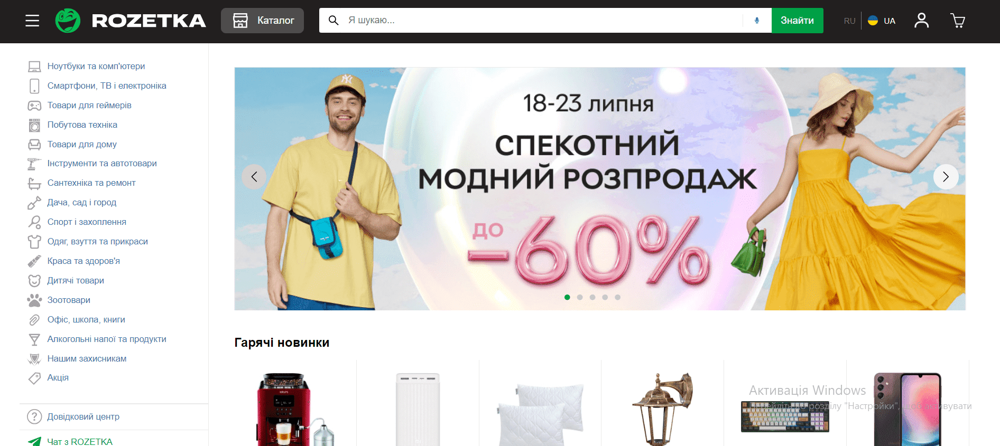

> I am a junior front-end developer.
>
> This pet project was created for my portfolio during my studies.

# Project 2: Visual "Rozetka" homepage copy

Rozetka.com.ua is a famous Ukrainian online shopping website.

I used its homepage as a template for practicing reproducing a **VISUAL** layout as close to the original as possible.

Original “Rozetka” website is often updated and has design changes. **This project was made some time ago, so it can look a bit different from the original now**.

<mark style="background-color: lightgreen">Note: This website has the Ukrainian language version only.</mark>

## Features

- It is a VISUAL copy! But I added some functionality as an opportunity to practise;
- You can add products to the cart using “buy” button under the product picture;
- You can increase or decrease the amount of products in the cart;
- You can delete products from the cart.

## Skills used

- Next.js
- Sass/Scss
- Git + Bash
- Redux

## What did I learn

- Building **complex adaptive layouts** (for devices ranging **from smartphones to large desktop screens**);
- Implementing **"hamburger" menu** navigation;
- Providing **cross-browser compatibility**;
- Using advanced React features, like **HOCs** and **custom hooks**;
- Creating **pop-ups**;
- Using **Redux** for **global state management**.

Here you can check the <a href="https://superlative-kleicha-ac1778.netlify.app/" target="_blank">deployed site</a>!
